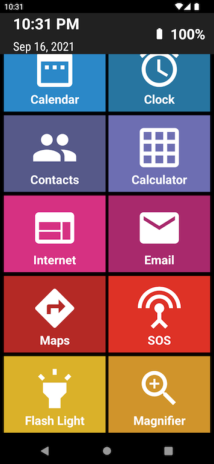
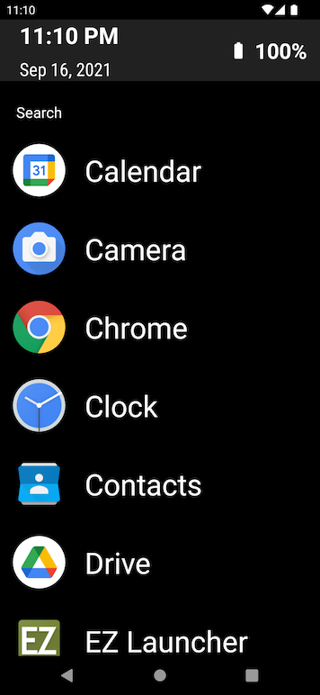

# EZ Launcher

A custom Android Launcher, with large buttons and a simplified feature set.  This app designed for ease of use by the elderly or vision impaired.

A built in magnifier app features a zoom function, flashlight toggle and high contrast modes.

## Technologies Used:

- [LifeCycle](https://developer.android.com/topic/libraries/architecture/lifecycle)
- [Navigation](https://developer.android.com/guide/navigation)
- [Databinding](https://developer.android.com/topic/libraries/data-binding)
- [View Binding](https://developer.android.com/topic/libraries/view-binding)
- [Vector Drawables](https://developer.android.com/guide/topics/graphics/vector-drawable-resources)
- [Battery Monitoring](https://developer.android.com/training/monitoring-device-state/battery-monitoring)
- [Camera API](https://developer.android.com/guide/topics/media/camera)

## Screenshots

### Main Page

### Main Page showing Flashlight toggle:

### Magnifier Activity

### All Apps View

